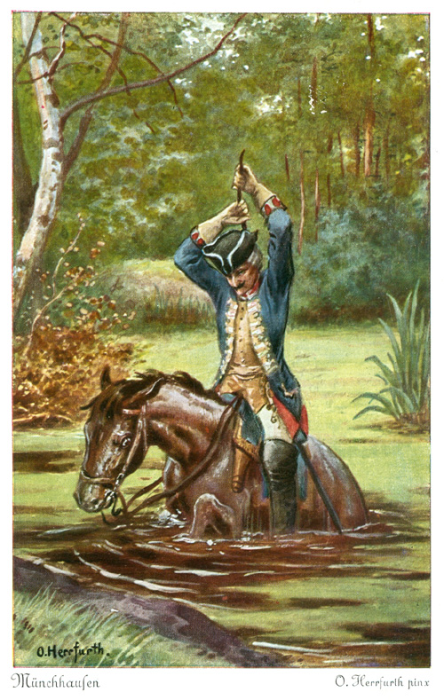

# munchhausen
Automatically wrap operating system commands with duplex streams.

Named after [Baron Munchausen](https://en.wikipedia.org/wiki/Baron_Munchausen) who pulled him self out of a lake by his own hair.


## Usage

```JavaScript
import { pipeline } from 'stream';
import munchhausen from 'munchhausen';
const {cat, grep} = munchhausen;
pipeline(

  ...await Promise.all([
    cat("package.json"),
    grep(echo("name"))
  ])

  err => console.error
).once('readable', function () {
  console.log( this.read().toString()) //  "name": "munchhausen",\n
})

```

## Credit
[Artwork](https://en.wikipedia.org/wiki/File:Muenchhausen_Herrfurth_7_500x789.jpg) Public Domain
